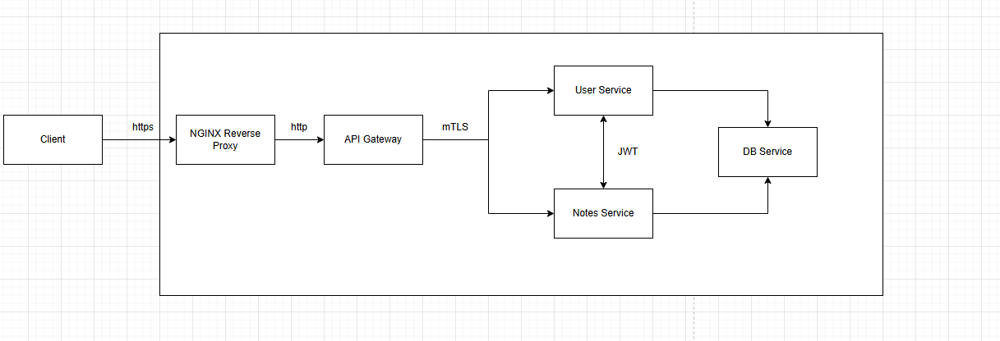

# How to run the app

```bash
docker compose -f docker-compose.dev.yml up --build
```

# Version 1 : Reverse Proxy and API Gateway based Micro service for a Notes applicatoin

This contains a simplified architecture of the application with an Reverse Proxy, API Gateway and 2 Services consuming them. Please note that the services are merely placeholders for me to get into the mechanicals of the architecture itself.

> Note : The Authorization and Authentication has not been implemented


